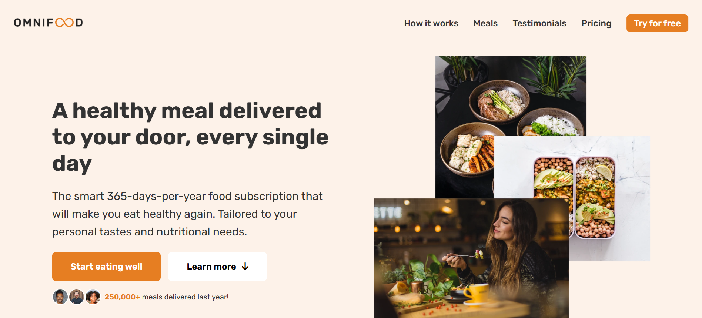

# 🍽️ Omnifood Website

Omnifood is a modern, responsive landing page for a smart food delivery service. This website is built entirely with **HTML5** and **CSS3** — no JavaScript — focusing on layout, design, and mobile responsiveness.

## 📸 Preview

> A clean, user-friendly design that adapts beautifully to all devices.

## 🚀 Features

- Fully responsive design for desktop, tablet, and mobile
- Built using **CSS Flexbox** and **CSS Grid**
- Clean layout with modern UI/UX
- Reusable CSS components and utility classes
- Uses custom properties (CSS variables) for easy theming
- Multiple sections:
  - Hero section with call-to-action
  - How it works
  - Featured meals
  - Customer testimonials
  - Pricing plans
  - Sign-up form
  - Footer with social links

## 🧱 Technologies Used

- **HTML5** for semantic markup
- **CSS3** for styling and layout (Flexbox, Grid, Media Queries)
- **Google Fonts** – [Rubik](https://fonts.google.com/specimen/Rubik)
- **Ionicons** – Free icon set from [ionic.io](https://ionic.io/ionicons)

## 📁 Folder Structure
